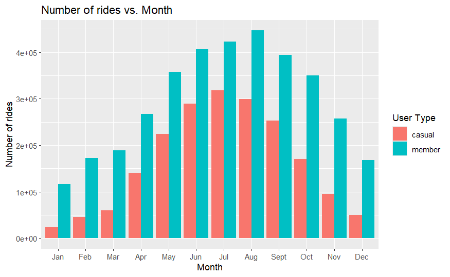

# Optimizing Subscription Growth: Data-Driven Strategies for Cyclistic
**A Case Study in Converting Casual Riders through Behavioral Analysis (March 2023 – February 2024)**

---

## Executive Summary
Cyclistic's long-term profitability depends on transitioning "Casual" riders into "Annual Members." By analyzing 12 months of historical trip data, this project identifies key behavioral pivots.

The most significant finding: Casual riders average **29.41 minutes** per trip—over 2x the duration of Members—presenting a massive opportunity for value-based conversion.

---

## Insights

### 1. The "Leisure vs. Utility" Divergence
The analysis reveals a fundamental difference in user intent. Members ride for utility (consistent ~13-minute trips), while Casual users ride for leisure, peaking at nearly 30 minutes. 
* **Member Pattern:** Highly consistent weekday usage, suggesting a reliance on the service for commuting.
* **Casual Pattern:** High-duration trips that suggest exploration, tourism, and recreation.

### 2. High-Intent Windows

Casual usage increase on **Saturdays and Sundays**. This is the "high-intent" window where casual riders are most active and likely to see the value of a membership for their weekend leisure activities, even if they aren't yet using it for a weekday commute.

### 3. Peak Season

Usage for both segments follows a strong seasonal bell curve, peaking from June through August. However, the surge in Casual riders during the summer months is significantly more pronounced.

Casual rider volume nearly triples from March to July. This seasonality defines the "Golden Window" for marketing, as the concentration of potential subscribers is at its highest density.

### 4. Hardware Preference

Usage across bike types is relatively balanced for both segments, with subtle preferences emerging:
* **Casual Riders:** Show a slight preference for Electric Bikes over Classic Bikes.
* **Annual Members:** Lean slightly more toward Classic Bikes.

Because both segments utilize both bike types significantly, marketing should focus on the cost-savings of membership regardless of hardware choice, rather than hardware exclusivity.

---

## Recommendations

* **Weekend Conversion:** Launch digital ad-buys specifically on weekends, targeting users who take multiple trips on Saturdays/Sundays with "Introductory Annual Rates."
* **Cost-Per-Minute Marketing:** Create a campaign highlighting that for rides over 20 minutes (the Casual average), an annual membership is significantly more cost-effective than single-trip pricing.
* **Seasonal Aggression:** Focus 60% of the marketing budget on the **Summer** months, as usage data shows this is the highest acquisition window for both segments.

---

##  Technical Methodology

I utilized a robust R-based pipeline to process the massive scale of the Divvy dataset:

* **Libraries:** `tidyverse` (dplyr, ggplot2), `skimr` (distribution analysis), `DescTools` (statistical profiling), and `pivottabler` (business-grade reporting).

* **Data Pipeline:** * Consistently merged 12 individual CSV files into a unified dataframe (approx. 5.5M+ records).
    * Executed data validation to remove negative trip durations and maintenance pings.
    * Engineered temporal features (Season, Day of Week, Month) to isolate seasonality trends.

---

## Project Structure
* [**View Full Analysis (HTML)**](Cyclistic.html) - Detailed technical report and interactive visuals.
* [**Source Code (Rmd)**](Cyclistic.Rmd) - Full R script for data cleaning and analysis.
* `/data`: Contains a [reduced dataset](./data/reduced_data.zip) for local testing and reproducibility.

> **Data Source:** Original trip data provided by Motivate International Inc. under this [license](https://divvybikes.com/data-license-agreement).

---

## Further Analysis
A strategic next step would be a **Geospatial Analysis** to map specific high-traffic stations for Casual riders. Identifying if these stations are primarily near parks or tourist landmarks would allow for even more localized, physical marketing activations.