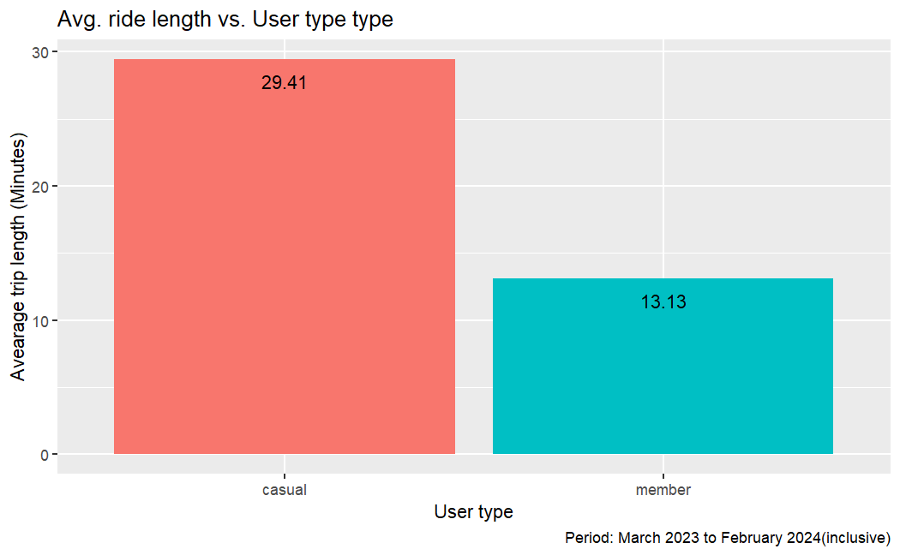
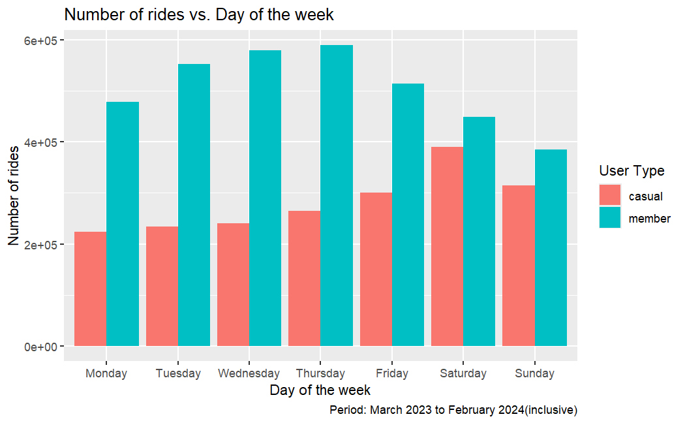
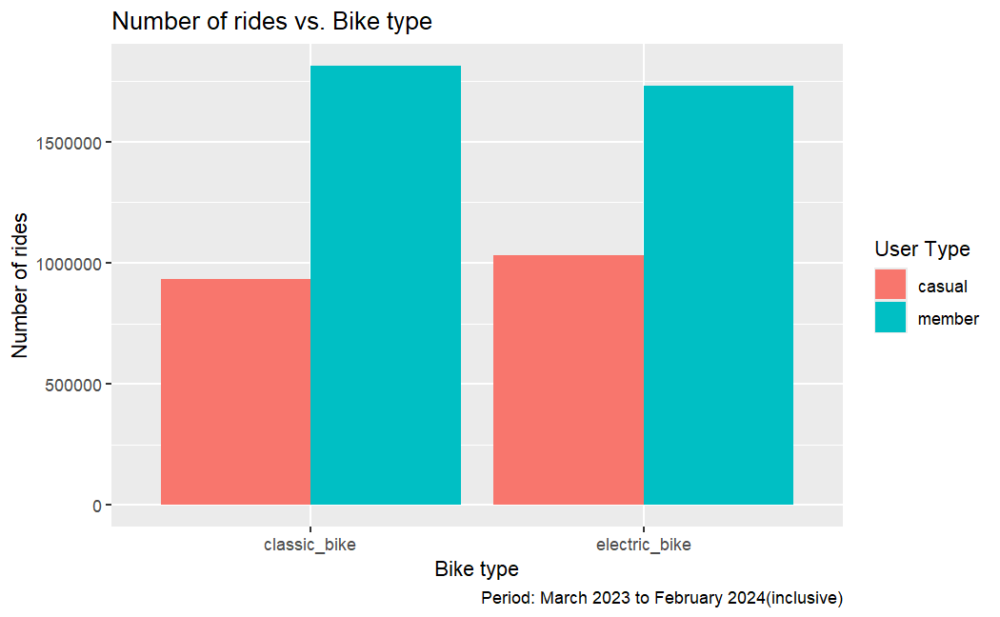

# Optimizing Subscription Growth: Data-Driven Strategies for Cyclistic
**A Case Study in Converting Casual Riders through Behavioral Analysis (March 2023 – February 2024)**

---

## Executive Summary
Cyclistic's long-term profitability depends on transitioning "Casual" riders into "Annual Members." By analyzing 12 months of historical trip data (approx. 5.5M+ records), this project identifies key behavioral pivots. The most significant finding: Casual riders average **29.41 minutes** per trip—over 2x the duration of Members—presenting a massive opportunity for value-based conversion.

---

## Strategic Business Insights

### 1. The "Leisure vs. Utility" Divergence
The analysis reveals a fundamental difference in user intent. Members ride for utility (consistent ~13-minute trips), while Casual users ride for leisure, peaking at nearly 30 minutes. 
* **Member Pattern:** Highly consistent weekday usage, suggesting a reliance on the service for commuting.
* **Casual Pattern:** High-duration trips that suggest exploration, tourism, and recreation.

### 2. High-Intent Windows: The Weekend Peak

Casual usage significantly outperforms member growth trends on **Saturdays and Sundays**. This indicates that the most effective window for conversion is the weekend, when Casual rider engagement is at its absolute peak.

### 3. Hardware Preference: The Electric Advantage

The data shows Casual riders have a stronger preference for **Electric Bikes** compared to the Member segment. Leveraging the premium appeal of the electric fleet could be a primary lever for subscription upgrades.

---

##  Technical Methodology
I utilized a robust R-based pipeline to process the massive scale of the Divvy dataset:
* **Libraries:** `tidyverse` (dplyr, ggplot2), `skimr` (distribution analysis), `DescTools` (statistical profiling), and `pivottabler` (business-grade reporting).
* **Data Pipeline:** * Consistently merged 12 individual CSV files into a unified dataframe.
    * Executed data validation to remove negative trip durations and maintenance pings.
    * Engineered temporal features (Season, Day of Week, Month) to isolate seasonality trends.

---

## The Growth Roadmap (Recommendations)

* **Weekend Warrior Conversion:** Launch digital ad-buys specifically on weekends, targeting users who take multiple trips on Saturdays/Sundays with "Introductory Annual Rates."
* **Cost-Per-Minute Marketing:** Create a campaign highlighting that for rides over 20 minutes (the Casual average), an annual membership is significantly more cost-effective than single-trip pricing.
* **Electric Bike Incentives:** Introduce "Member-Only" discounts or priority access for the Electric Bike fleet to convert hardware-motivated Casual riders.
* **Seasonal Aggression:** Focus 60% of the marketing budget on the **Summer** months, as usage data shows this is the highest acquisition window for both segments.

---

## Project Structure
* [**View Full Analysis (HTML)**](Cyclistic.html) - Detailed technical report and interactive visuals.
* [**Source Code (Rmd)**](Cyclistic.Rmd) - Full R script for data cleaning and analysis.
* `/data`: Contains a [reduced dataset](./data/reduced_data.zip) for local testing and reproducibility.

> **Data Source:** Original trip data provided by Motivate International Inc. under this [license](https://divvybikes.com/data-license-agreement).

---

## 🔍 Further Analysis
A strategic next step would be a **Geospatial Analysis** to map specific high-traffic stations for Casual riders. Identifying if these stations are primarily near parks or tourist landmarks would allow for even more localized, physical marketing activations.